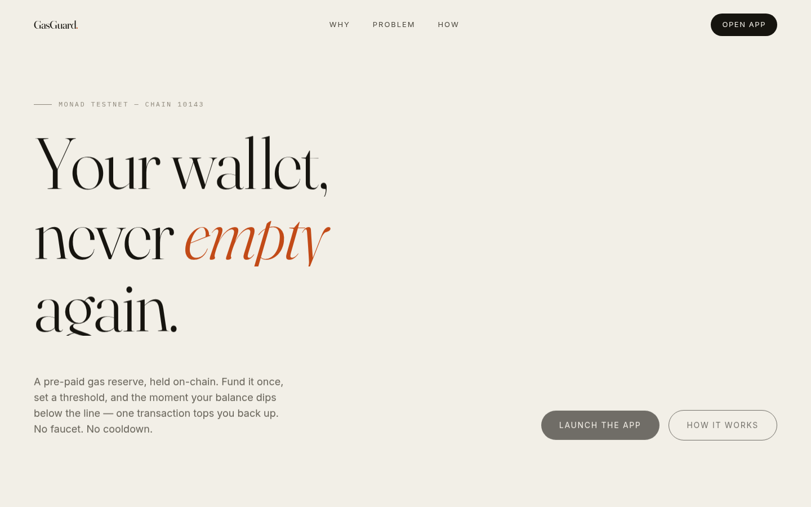
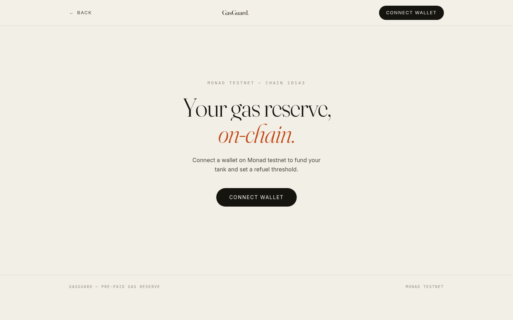

<p align="center">
  
</p>

<p align="center">
  
  
  
  
</p>

<p align="center">
  
  
  
  
</p>

<h1 align="center">GasGuard</h1>
<h3 align="center"><em>The pre-paid gas reserve for your wallet.<br>Never run out of gas mid-deployment again.</em></h3>

<p align="center">
  <strong>A smart-contract fuel tank for Monad. Pre-fund it once, set a balance threshold for any wallet, and refuel in a single transaction the moment you dip below the line — no faucet, no cooldown, no lost momentum. Built for the Build Anything Hackathon.</strong>
</p>

<p align="center">
  <a href="https://gasguard-two.vercel.app"><strong>🔗 Live Demo</strong></a> &bull;
  <a href="https://github.com/subheeksh5599/gasguard"><strong>📦 GitHub</strong></a> &bull;
  <a href="#the-problem">Problem</a> &bull;
  <a href="#the-solution">Solution</a> &bull;
  <a href="#architecture">Architecture</a> &bull;
  <a href="#quick-start">Quick Start</a> &bull;
  <a href="#contracts">Contracts</a> &bull;
  <a href="#design">Design</a> &bull;
  <a href="#roadmap">Roadmap</a> &bull;
  <a href="#faq">FAQ</a>
</p>

<p align="center">
  
</p>

<p align="center">
  
</p>

---

## The Problem

You're deploying a contract to Monad testnet. The RPC is slow, you're rushing, and the transaction fails — out of gas. You forgot to check your balance. Now you're stuck waiting for a faucet cooldown while your flow evaporates. Every builder has hit this wall.

| Problem | Impact |
|---------|--------|
| **Silent balance drain** | You never notice your wallet is low until a transaction reverts mid-deploy |
| **Faucet cooldowns** | Once you're empty, you wait — faucets rate-limit and testnet MON isn't always instant |
| **Context switching** | Topping up means leaving your terminal, hunting for a faucet, and losing your place |
| **Shared team wallets** | "Can someone send me testnet MON?" is the most repeated message in every dev group chat |
| **No safety net** | There is no on-chain primitive that automatically keeps a wallet above a working balance |
| **Manual, error-prone** | Watching balances by hand doesn't scale across the many wallets a builder juggles |

---

## The Solution

GasGuard is a smart-contract **fuel tank**. Pre-fund it once with testnet MON, set a minimum balance threshold for any wallet, and when that wallet dips below the line, a top-up is released in a single transaction. Like a reserve fuel tank — fill it once, it saves you later.

```
1. DEPOSIT ──> 2. CONFIGURE ──> 3. MONITOR ──> 4. REFUEL
   MON into        wallet to        web app         balance < threshold
   your tank       watch +          polls balance          │
                   threshold +      via RPC          checkAndRefuel(wallet)
                   top-up amount                            │
                                                     tops up in 1 tx
```

### What you get

- **Pre-paid gas reserve** — Deposit MON into a per-user tank held by the contract. It's yours; withdraw the unused balance anytime.
- **Threshold-based refuel** — Set a minimum balance and a top-up amount for any wallet. The contract only releases funds when the watched wallet is genuinely below threshold.
- **Multi-wallet support (v2)** — One tank can watch and refuel many wallets — your deployer, your CI bot, your teammate's hot wallet. Each wallet gets its own threshold and top-up amount.
- **One-transaction top-up** — `checkAndRefuel` validates the balance on-chain and sends the top-up atomically. No multi-step dance.
- **Refuel all at once** — `checkAndRefuelAll(owner)` tops up every below-threshold wallet in a single transaction. Perfect for keeper bots.
- **Permissionless triggering** — Anyone can call `checkAndRefuel` for a configured owner. The contract enforces the rules, so a keeper, teammate, or cron can keep you topped up.
- **Optional keeper bot** — A lightweight Node.js bot that polls the chain and auto-refuels every below-threshold wallet. Drop it on a $5 VPS or run it in a cron job.
- **On-chain enforcement** — Thresholds and amounts are enforced by the EVM. The contract says no → the transaction reverts. No trusted server.
- **Withdraw anytime** — Your tank is a reserve, not a lock-up. Pull unused MON back to your wallet in one transaction, with a one-click "Max" in the UI.
- **A UI you'd actually keep open** — An editorial, motion-driven dashboard shows wallet balance, tank balance, and refuel status live (10-second polling), with one-click deposit, add wallet, refuel, and withdraw.

---

## Live Demo

**Production URL:** [https://gasguard-two.vercel.app](https://gasguard-two.vercel.app)

### Try it in 30 seconds

1. Connect a wallet on **Monad Testnet** (Chain ID `10143`).
2. Deposit `0.5` MON into your GasGuard tank.
3. Configure: watch your wallet, threshold `0.1` MON, top-up `0.25` MON.
4. When your balance drops below `0.1` MON, hit **Refuel** — `0.25` MON lands in one transaction.
5. Withdraw the unused tank balance whenever you're done.

---

## Architecture

```
┌─────────────────────────────────────────────────────────┐
│                   WEB APP (Vite + React)                │
│                                                         │
│  ┌──────────┐  ┌───────────┐  ┌──────────┐  ┌────────┐ │
│  │ Connect  │  │ Dashboard │  │  Deposit │  │ Refuel │ │
│  │ Wallet   │  │           │  │  + Config│  │ Button │ │
│  └────┬─────┘  └─────┬─────┘  └────┬─────┘  └───┬────┘ │
│       │              │              │            │      │
│       └──────────────┴──────────────┴────────────┘      │
│                          │                              │
│                    ethers.js v6                         │
└──────────────────────────┼──────────────────────────────┘
                           │
                    Monad Testnet RPC
                    (Chain ID 10143)
                           │
┌──────────────────────────┼──────────────────────────────┐
│                     GASGUARD.SOL                        │
│                                                         │
│  Storage:                                               │
│  ┌──────────────────────────────────────────────────┐  │
│  │ tankBalance[address]  → uint256 (per-user vault) │  │
│  │ walletConfig[address] → {threshold, topUp, active}│  │
│  └──────────────────────────────────────────────────┘  │
│                                                         │
│  Functions:                                             │
│  ┌──────────────────────────────────────────────────┐  │
│  │ deposit()            fund your tank with MON      │  │
│  │ setConfig(w, t, a)   set wallet/threshold/amount  │  │
│  │ clearConfig()        stop refuels, keep funds     │  │
│  │ checkAndRefuel(o)    if o.balance < threshold     │  │
│  │                      → send topUp from tank       │  │
│  │ withdraw(amount)     pull unused MON back         │  │
│  │ needsRefuel(o)       view: would refuel now?      │  │
│  └──────────────────────────────────────────────────┘  │
│                                                         │
│  Events: Deposited, Withdrawn, Refueled, ConfigSet      │
└──────────────────────────────────────────────────────────┘
```

### Stack

| Layer | Technology |
|-------|-----------|
| Frontend | React 18, Vite 5, Tailwind CSS 3 |
| Wallet | ethers.js v6 + `window.ethereum` (no adapter bloat) |
| Smart Contract | Solidity 0.8.20, Foundry (forge, cast, anvil) |
| Chain | Monad Testnet (Chain ID 10143), MON native currency |
| RPC | Monad public RPC (no API key required) |
| Deployment | Vercel (frontend), Foundry script (contract) |

---

## Quick Start

### Prerequisites

- Node.js 18+
- [Foundry](https://book.getfoundry.sh/getting-started/installation)

### 1. Clone and install

```bash
git clone https://github.com/subheeksh5599/gasguard.git
cd gasguard

# Frontend
cd web && npm install && cd ..

# Contracts (installs forge-std)
cd contracts && forge install && cd ..
```

### 2. Build & test contracts (16 tests, all passing)

```bash
cd contracts
forge build
forge test -vvv
```

### 3. Deploy the contract

```bash
cp .env.example .env
# Fill in PRIVATE_KEY and MONAD_RPC_URL
forge script script/Deploy.s.sol:DeployGasGuard \
  --rpc-url $MONAD_RPC_URL --broadcast
```

### 4. Run the web app

```bash
cd web
cp .env.example .env
# Set VITE_CONTRACT_ADDRESS to your deployed address
npm run dev          # → http://localhost:5173
```

### 5. Build for production

```bash
cd web && npm run build   # outputs to dist/
```

---

## Contracts

### Deployed Address (Monad Testnet)

| Contract | Address |
|----------|---------|
| GasGuard | [`0x89B230004eEf2115486F4C76529659D5a85D9397`](https://testnet.monadexplorer.com/address/0x89B230004eEf2115486F4C76529659D5a85D9397) |

Deployed on Monad Testnet (Chain ID `10143`).

### GasGuard.sol

Per-user gas reserve with threshold-based, permissionless refuels.

```solidity
struct Config {
    uint256 threshold;   // minimum wallet balance before refuel is allowed
    uint256 topUpAmount; // how much MON to send per refuel
    bool active;
}

mapping(address => uint256) public tankBalance;                     // per-user vault
mapping(address => mapping(address => Config)) public walletConfig;  // owner => watchedWallet => config
```

| Function | Access | Description |
|----------|--------|-------------|
| `deposit()` | Public payable | Fund your tank with MON |
| `setConfig(wallet, threshold, topUpAmount)` | Public | Add or update a wallet to watch (requires tank balance) |
| `removeWallet(wallet)` | Public | Stop watching a single wallet |
| `clearConfig()` | Public | Remove all watched wallets; tank balance stays |
| `checkAndRefuel(owner, wallet)` | Public | If watched wallet balance < threshold, send topUp from owner's tank |
| `checkAndRefuelAll(owner)` | Public | Refuel ALL below-threshold wallets in one transaction |
| `withdraw(amount)` | Public | Pull unused MON back from your tank |
| `getConfig(owner, wallet)` | View | Return `(threshold, topUpAmount, active)` for a watched wallet |
| `getWallets(owner)` | View | Return array of watched wallet addresses |
| `getWalletCount(owner)` | View | Return number of watched wallets |
| `getAllConfigs(owner)` | View | Return all wallets + configs + needsRefuel in one call |
| `needsRefuel(owner, wallet)` | View | Would a refuel fire right now for this wallet? |

**Events:** `Deposited`, `Withdrawn`, `Refueled`, `ConfigSet`, `WalletRemoved`

### Test Coverage

```
Ran 24 tests for test/GasGuard.t.sol:GasGuardTest

[PASS] test_Deposit_IncreasesTank
[PASS] test_Deposit_EmitsEvent
[PASS] test_Deposit_ZeroReverts
[PASS] test_Receive_Deposits
[PASS] test_SetConfig_RequiresTankBalance
[PASS] test_SetConfig_StoresConfig
[PASS] test_SetConfig_EmitsEvent
[PASS] test_MultiWallet_AddMultipleWallets
[PASS] test_RemoveWallet_RemovesFromList
[PASS] test_RemoveWallet_RevertsWhenNotFound
[PASS] test_RemoveWallet_EmitsEvent
[PASS] test_ClearConfig_RemovesAllWallets
[PASS] test_NeedsRefuel_FalseWithoutConfig
[PASS] test_NeedsRefuel_TrueWhenBelowThreshold
[PASS] test_CheckAndRefuel_RevertsWithoutConfig
[PASS] test_CheckAndRefuel_SendsWhenBelowThreshold
[PASS] test_CheckAndRefuel_NoopWhenAboveThreshold
[PASS] test_CheckAndRefuel_RevertsWhenTankTooLow
[PASS] test_CheckAndRefuelAll_RefuelsAllBelowThreshold
[PASS] test_CheckAndRefuelAll_SkipsAboveThreshold
[PASS] test_CheckAndRefuelAll_RevertsWhenTankTooLow
[PASS] test_GetAllConfigs_ReturnsAll
[PASS] test_Withdraw_ReducesTankAndPays
[PASS] test_Withdraw_RevertsWhenInsufficient

Suite result: ok. 24 passed; 0 failed; 0 skipped
```

### Keeper Bot

A lightweight Node.js bot that monitors configured wallets and auto-refuels any that drop below threshold:

```bash
cd keeper
cp .env.example .env
# Set PRIVATE_KEY (keeper wallet needs MON for gas)
# Set WATCH_OWNERS (comma-separated tank owner addresses)
npm install
npm start              # continuous mode (polls every 30s)
npm run run-once       # run once and exit
```

The bot calls `getAllConfigs(owner)` to check which wallets are below threshold, then fires `checkAndRefuelAll(owner)` in a single transaction. Run it on a cron, a $5 VPS, or even a Vercel cron job.

### Multi-Chain Deployment

Deploy GasGuard to any EVM testnet using CREATE2 (same address on every chain):

```bash
cd contracts
# Single chain
forge script script/Deploy.s.sol:DeployGasGuardCreate2 \
  --rpc-url $SEPOLIA_RPC_URL --broadcast --sig "run(uint256)" 42069101

# All chains (requires .env with PRIVATE_KEY)
./script/deploy-all.sh all
# Or pick specific chains
./script/deploy-all.sh sepolia,base_sepolia,arbitrum_sepolia
```

---

## Project Structure

```
gasguard/
├── contracts/                # Solidity (Foundry)
│   ├── src/GasGuard.sol       # Main contract (v2 multi-wallet)
│   ├── test/GasGuard.t.sol    # 24 tests (all passing)
│   ├── script/Deploy.s.sol    # Monad + multi-chain CREATE2 deploy
│   ├── script/deploy-all.sh   # Deploy to all testnets
│   ├── foundry.toml
│   └── .env.example
├── web/                       # React frontend (Vite)
│   ├── src/
│   │   ├── App.jsx            # Landing (motion) + dashboard views
│   │   ├── components/        # ConnectWallet, Dashboard, WatchedWallets,
│   │   │                      #   DepositForm, ConfigPanel, RefuelButton,
│   │   │                      #   WithdrawForm, TxHistory
│   │   ├── hooks/             # useWallet, useGasGuard
│   │   ├── utils/contract.js  # ABI + address helpers (v2)
│   │   └── index.css          # Design system (Fraunces/Inter/Plex Mono)
│   ├── index.html
│   ├── vite.config.js
│   └── package.json
├── keeper/                    # Automation bot
│   ├── bot.js                 # Keeper: polls chain, auto-refuels
│   ├── package.json
│   └── .env.example
├── vercel.json                # Vercel deployment config
├── README.md
└── .gitignore
```

---

## Design

The frontend is deliberately not a template. It's an editorial, print-inspired interface built from scratch:

- **Typography-led** — Fraunces (variable optical sizing) for display, Inter for body, IBM Plex Mono for on-chain data
- **Warm paper palette** — off-white `#F2EFE7`, ink `#16140F`, a single burnt-orange accent `#C24A17`. No neon gradients, no glassmorphism
- **Motion with intent** — masked line-reveals on load, word-by-word manifesto that lights up as you scroll, a pausable marquee, parallax hero exit, hover-indexed problem rows, and staggered card reveals — all via `IntersectionObserver` and CSS transforms (no animation libraries, zero extra bundle weight)
- **Accessible** — full `prefers-reduced-motion` support disables every animation for users who ask for it
- **Live dashboard** — the same design system carries into the app: three stat panels (wallet, tank, status), an armed refuel banner that pulses when gas is low, and deposit / configure / withdraw / history panels that poll the chain every 10 seconds

---

## Security

- **On-chain enforcement** — Thresholds and top-up amounts are checked by the EVM at call time, not by a trusted server.
- **Balance verified at execution** — `checkAndRefuel` re-reads `owner.balance` on-chain, so a refuel can only fire when the wallet is genuinely below threshold.
- **Isolated tanks** — Each user's `tankBalance` is separate; a refuel only draws from the owner's own tank.
- **Custom errors** — `NoTankBalance`, `NoConfigSet`, `InsufficientTankBalance`, `RefuelFailed`, `WithdrawFailed`, `ZeroAmount` for cheap, explicit reverts.
- **No admin keys** — Non-upgradeable, no owner privileges, no proxy. There is nothing to compromise.
- **Withdraw anytime** — Your unused MON is never locked; `withdraw` returns it on demand.

---

## Roadmap

| Phase | What | Status |
|-------|------|--------|
| **Phase 1** — Hackathon MVP | Deposit tank, threshold config, one-click refuel, live dashboard | ✅ Done |
| **Phase 2** — Automation | Keeper bot that calls `checkAndRefuelAll` automatically when any wallet drops below threshold | ✅ Done |
| **Phase 3** — Multi-wallet | Watch and refuel many wallets from one tank (teams, CI runners) — one-click refuel all | ✅ Done |
| **Phase 4** — Multi-chain | Deploy-ready: CREATE2 deploy script for any EVM testnet (Sepolia, Base, Arbitrum, Optimism, Polygon, Blast) | ✅ Done |

---

## Team

| Name | Role | Links |
|------|------|-------|
| **Subheeksh** | Solo Developer — Smart Contract, Frontend, Architecture | [GitHub](https://github.com/subheeksh5599) · [X](https://x.com/KomariS18774) |

Built solo for the **Build Anything Hackathon** on Monad.

---

## FAQ

<details>
<summary><strong>Why not just check my balance manually?</strong></summary>

You can — until you forget once mid-deploy and lose your flow to a faucet cooldown. GasGuard turns "remember to top up" into an on-chain primitive: fund a tank once, and a top-up is one click (or one keeper call) away the moment you drop below your threshold.
</details>

<details>
<summary><strong>Who can trigger a refuel?</strong></summary>

Anyone. `checkAndRefuel(owner)` is permissionless — but it only releases funds when the owner's wallet is genuinely below the configured threshold, and only from the owner's own tank. That lets a teammate, keeper, or cron keep you topped up without holding your keys.
</details>

<details>
<summary><strong>Can I get my MON back?</strong></summary>

Yes. Your tank balance is yours. Call `withdraw(amount)` at any time to pull unused MON back to your wallet. Nothing is locked.
</details>

<details>
<summary><strong>What stops someone from draining my tank?</strong></summary>

The contract only sends the configured `topUpAmount`, only to the address you configured, and only while that wallet is below `threshold`. Once the balance is above threshold, `checkAndRefuel` is a no-op. Funds only move under your rules.
</details>

<details>
<summary><strong>Is this mainnet-ready?</strong></summary>

It's deployed on Monad testnet and covered by 16 passing Foundry tests, but it has not been externally audited. Don't use it with real funds.
</details>

<details>
<summary><strong>Which chains are supported?</strong></summary>

Currently Monad Testnet (Chain ID 10143). The contract is plain EVM Solidity 0.8.20 and can be deployed to any EVM chain — multi-chain deployment is on the roadmap.
</details>

---

## Powered by

<p align="center">
  <strong><a href="https://monad.xyz">Monad</a></strong> — high-performance EVM testnet<br>
  <strong><a href="https://getfoundry.sh">Foundry</a></strong> — contract build, test, and deploy<br>
  <em>Built for the Build Anything Hackathon</em>
</p>

---

## License

MIT. Build whatever you want with it.
